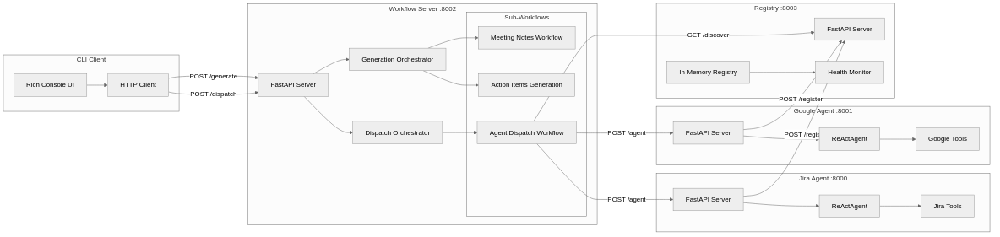
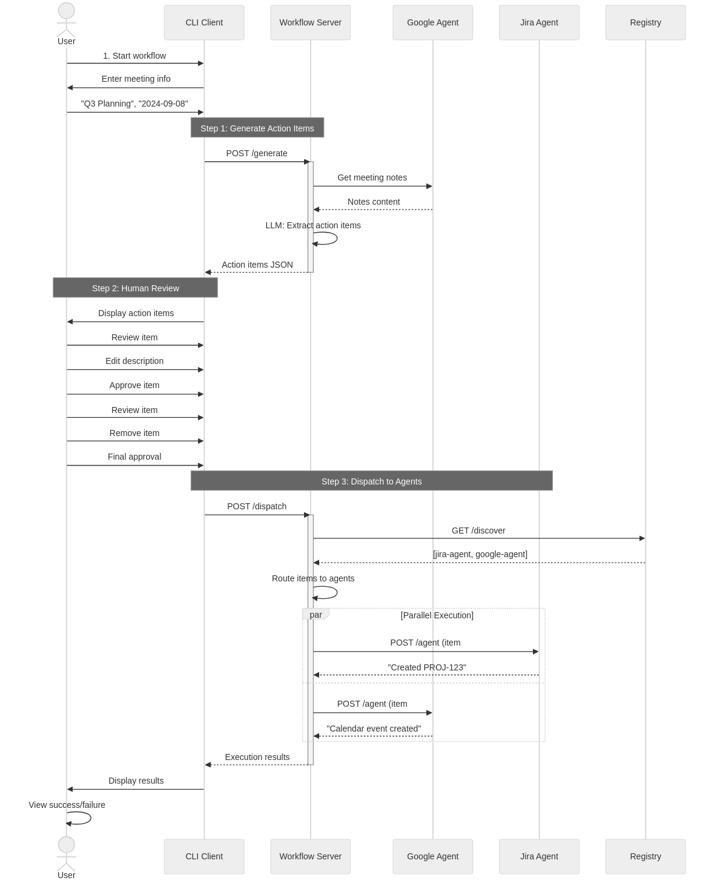
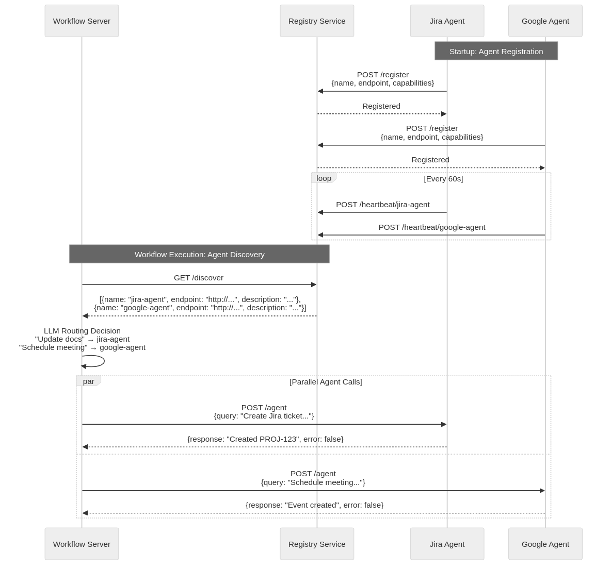
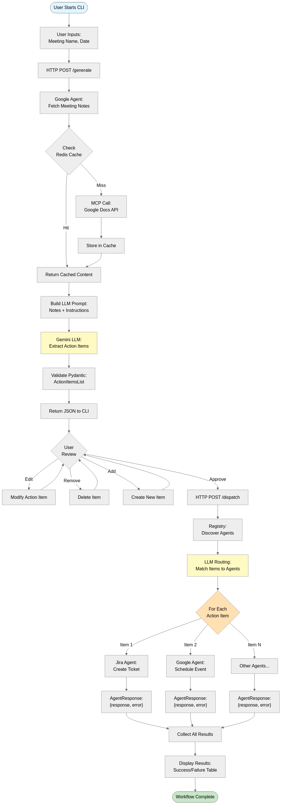
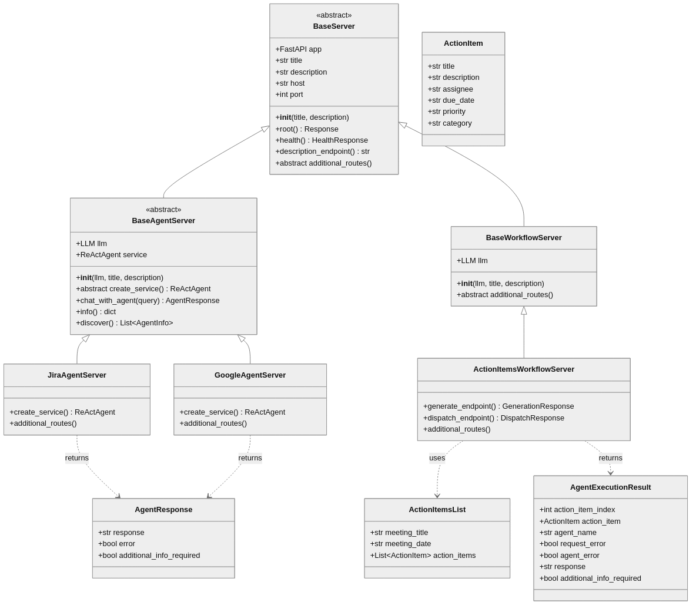
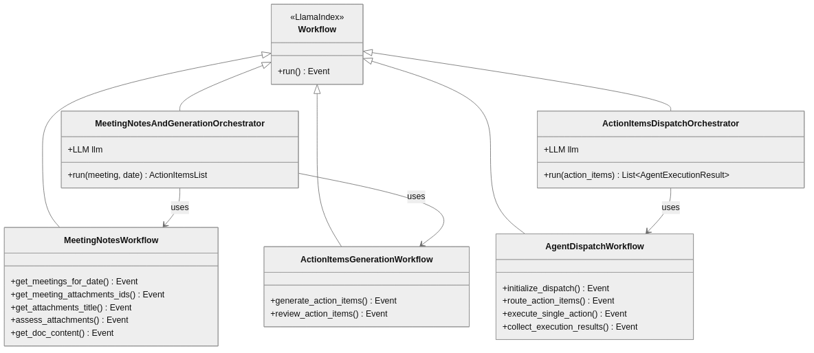
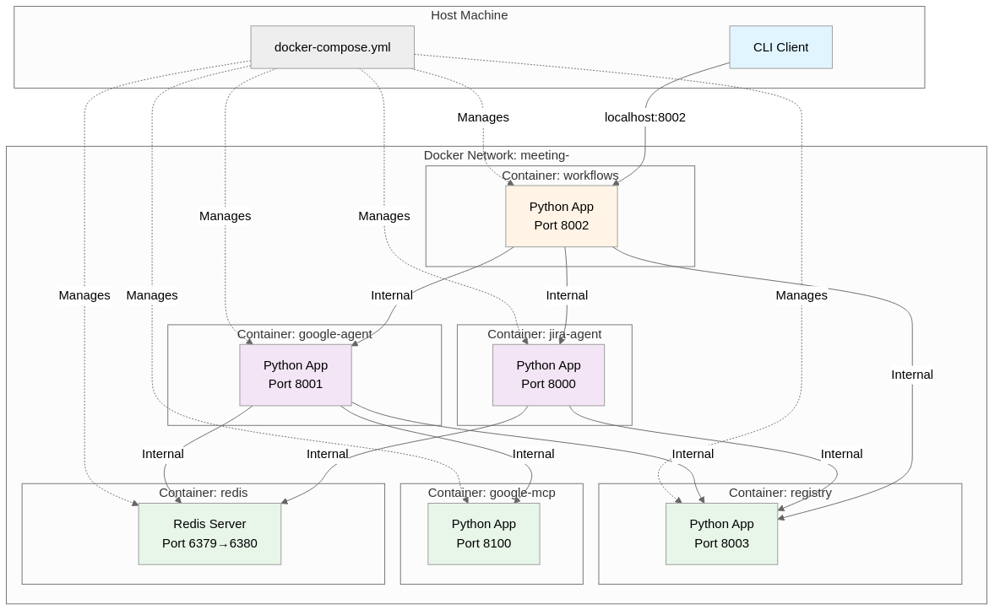
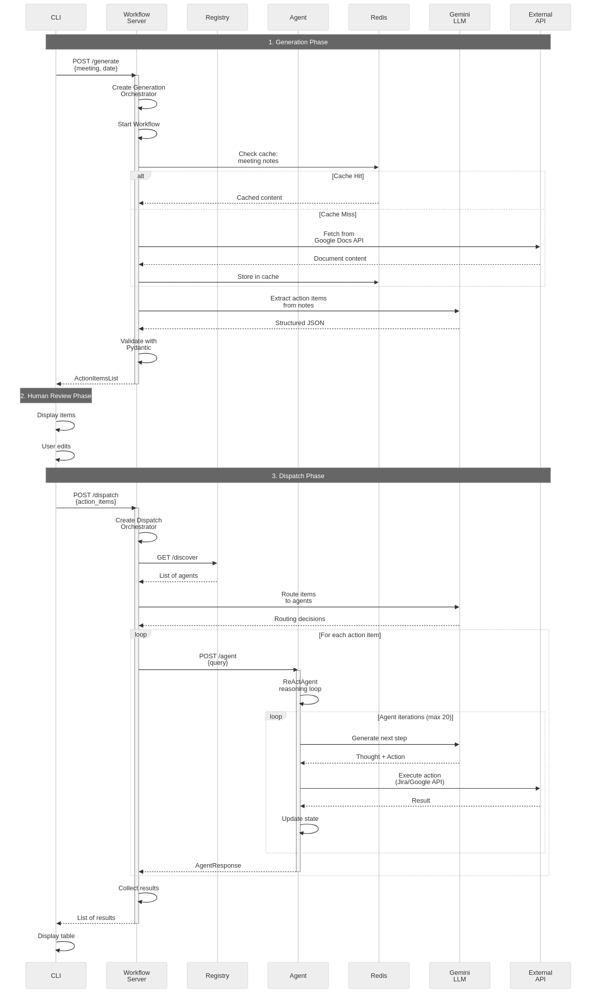
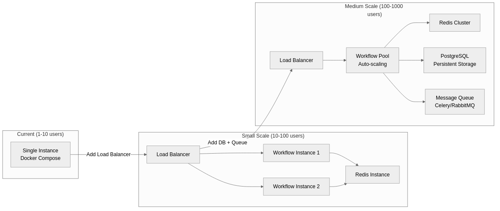
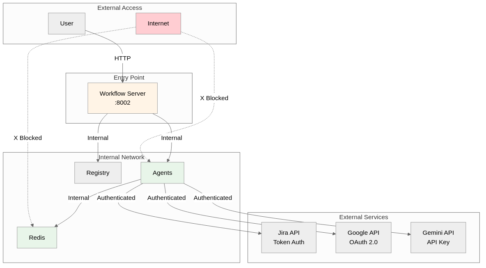

# MeetingActions - Architecture Documentation

**Date**: 2025-10-19
**Version**: 1.0
**Purpose**: Comprehensive architecture diagrams and documentation

---

## 📊 Table of Contents

1. [System Architecture Overview](#1-system-architecture-overview)
2. [Service Component Diagram](#2-service-component-diagram)
3. [Human-in-the-Loop Workflow](#3-human-in-the-loop-workflow)
4. [Agent Communication Pattern](#4-agent-communication-pattern)
5. [Data Flow Diagram](#5-data-flow-diagram)
6. [Class Architecture](#6-class-architecture)
7. [Deployment Architecture](#7-deployment-architecture)

---

## 1. System Architecture Overview

### High-Level Components


**Key Points:**
- **Client Layer**: User-facing CLI for human-in-the-loop interaction
- **Workflow Layer**: Orchestrates workflows and routes to agents
- **Agent Layer**: Specialized agents (Jira, Google) with domain expertise
- **Infrastructure**: Service discovery, caching, and tool protocols
- **External Services**: Third-party APIs and LLM providers

---

## 2. Service Component Diagram

### Detailed Component View




**Component Responsibilities:**

| Component | Responsibility |
|-----------|---------------|
| **CLI Client** | User interaction, action item review/editing |
| **Workflow Server** | Orchestrates multi-step workflows |
| **Generation Orchestrator** | Retrieves notes → generates action items |
| **Dispatch Orchestrator** | Routes items → dispatches to agents |
| **Agents** | Execute domain-specific tasks (Jira, Google) |
| **Registry** | Service discovery and health monitoring |

---

## 3. Human-in-the-Loop Workflow

### Complete User Journey




**Workflow Steps:**

1. **Generation** (5-30s)
   - Fetch meeting notes from Google
   - LLM extracts structured action items
   - Return for human review

2. **Human Review** (Variable)
   - User reviews each item individually
   - Can edit, approve, or remove items
   - Can add new items manually
   - Final approval before dispatch

3. **Dispatch** (10-60s)
   - Discover available agents
   - Route items to appropriate agents
   - **Execute in parallel** (LlamaIndex workflow)
   - Collect and display results

---

## 4. Agent Communication Pattern

### Service Discovery & Execution




**Agent Registration Fields:**

```json
{
  "agent_id": "jira-agent-uuid",
  "name": "jira-agent",
  "endpoint": "http://localhost:8000",
  "health_endpoint": "http://localhost:8000/health",
  "description": "Jira task management and issue tracking",
  "capabilities": ["create_issue", "update_issue", "search"],
  "last_heartbeat": "2024-09-08T10:30:00Z"
}
```

---

## 5. Data Flow Diagram

### Action Items Processing Flow




**Data Transformations:**

1. **Meeting Info** → HTTP Request
2. **Google Docs** → Plain Text → Redis Cache
3. **Plain Text** → LLM Prompt → **ActionItemsList** (Pydantic)
4. **ActionItemsList** → User Edits → Modified ActionItemsList
5. **Action Items** → Routing Decisions → Agent Queries
6. **Agent Responses** → **AgentExecutionResults** → User Display

---

## 6. Class Architecture

### Core Base Classes




### Workflow Architecture




**Key Design Patterns:**

1. **Template Method**: `BaseServer` defines structure, subclasses implement details
2. **Strategy Pattern**: Different agents implement same `create_service()` interface
3. **Observer Pattern**: Workflow events trigger step execution
4. **Singleton Pattern**: Redis cache, config reader
5. **Factory Pattern**: Agent creation, model instantiation

---

## 7. Deployment Architecture

### Docker Container Layout




**Port Mapping:**

| Service | Container Port | Host Port | Purpose |
|---------|---------------|-----------|---------|
| Jira Agent | 8000 | 8000 | Agent API |
| Google Agent | 8001 | 8001 | Agent API |
| Workflows | 8002 | 8002 | Workflow API (main entry) |
| Registry | 8003 | 8003 | Service discovery |
| Google MCP | 8100 | 8100 | MCP protocol |
| Redis | 6379 | 6380 | Cache storage |

**Network Communication:**

- **External**: Only port 8002 needs to be accessible from host
- **Internal**: All services communicate via Docker network
- **Security**: Redis and MCP not exposed externally

---

## 8. Technology Stack

### Technology Diagram


**Core Dependencies:**

- **FastAPI**: REST API framework
- **LlamaIndex**: ReActAgent framework for AI agents
- **Pydantic**: Data validation and schemas
- **Redis**: High-performance caching
- **Docker**: Container orchestration
- **Rich**: Beautiful terminal UI
- **Langfuse**: LLM observability and tracing

---

## 9. Request/Response Flow

### Complete Request Lifecycle




---

## 10. Key Architectural Decisions

### Design Principles

| Principle | Implementation | Benefit |
|-----------|---------------|---------|
| **Separation of Concerns** | Agents vs Workflows vs Infrastructure | Easy to extend, maintain |
| **Single Responsibility** | Each agent handles one domain | Clear boundaries |
| **Open/Closed** | Base classes + abstract methods | Extensible without modification |
| **Dependency Inversion** | Interfaces, not implementations | Loose coupling |
| **Human-in-the-Loop** | Separate generate/dispatch | User control and review |
| **Event-Driven** | LlamaIndex workflows | Async, parallel execution |
| **Unified Schema** | AgentResponse across all agents | Consistency |
| **Service Discovery** | Agent registry | Dynamic scaling |

### Why LlamaIndex Workflows?

**Advantages:**
1. ✅ **Built-in parallelization**: `ctx.send_event()` → automatic parallel execution
2. ✅ **Event-driven**: Clean separation of workflow steps
3. ✅ **Type-safe**: Pydantic models for events
4. ✅ **Observable**: Integration with Langfuse
5. ✅ **Testable**: Each step can be tested independently

**Alternative considered**: Raw `asyncio.gather()` → Rejected due to complexity

### Why Separate Generation/Dispatch?

**Human-in-the-Loop Pattern:**
- **Generation**: AI creates draft → User reviews
- **Dispatch**: User approves → System executes

**Benefits:**
- User control over what gets executed
- Catch AI errors before external API calls
- Modify items based on business context
- Audit trail of what was changed

---

## 11. Scalability Considerations

### Current Limitations

| Aspect | Current State | Bottleneck |
|--------|--------------|-----------|
| **Concurrent Workflows** | Single instance | Memory, CPU |
| **Agent Calls** | Parallel via workflow | LLM rate limits |
| **Cache** | Single Redis instance | Redis memory |
| **Service Discovery** | In-memory registry | Process restart |
| **Data Persistence** | None | No history |




---

## 12. Security Architecture

### Current Security Model




**Security Measures:**

1. ✅ **Network Isolation**: Internal Docker network
2. ✅ **API Authentication**: Jira tokens, Google OAuth
3. ✅ **Redis Password**: Required for cache access
4. ❌ **No API Auth**: Workflow server endpoints unprotected
5. ❌ **No Rate Limiting**: Could be abused
6. ❌ **No Input Sanitization**: Potential injection risks

---

## Summary

**Architecture Highlights:**

✅ **Clean separation**: Agents, Workflows, Infrastructure
✅ **Event-driven**: LlamaIndex workflows with parallel execution
✅ **Service discovery**: Dynamic agent registration
✅ **Human-in-the-loop**: Two-phase workflow (generate → dispatch)
✅ **Unified schema**: Consistent AgentResponse across all agents
✅ **Observable**: Langfuse integration for LLM tracing
✅ **Containerized**: Docker for easy deployment

**Next Steps for Scaling:**
1. Implement API authentication
2. Set up monitoring and alerting
3. Implement horizontal scaling with load balancer

---

**Last Updated**: 2025-10-19
**Maintained By**: Ella Shulman and Claude
**License**: See LICENSE file
