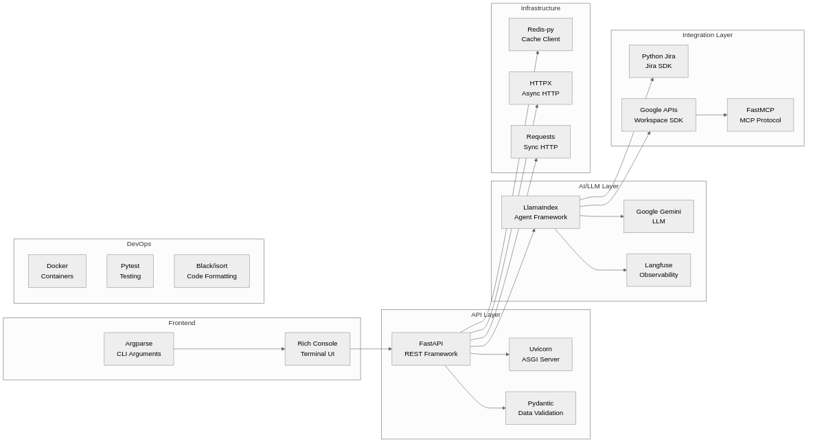

# MeetingActions - Architecture Documentation

**Date**: 2025-11-23
**Version**: 1.1
**Purpose**: Comprehensive architecture diagrams and documentation

---

## 📊 Table of Contents

1. [System Architecture Overview](#1-system-architecture-overview)
2. [Service Component Diagram](#2-service-component-diagram)
3. [Human-in-the-Loop Workflow](#3-human-in-the-loop-workflow)
4. [Agent Communication Pattern](#4-agent-communication-pattern)
5. [Data Flow Diagram](#5-data-flow-diagram)
6. [Class Architecture](#6-class-architecture)
7. [Deployment Architecture](#7-deployment-architecture)

---

## 1. System Architecture Overview

### High-Level Components


**Key Points:**
- **Client Layer**: User-facing CLI for human-in-the-loop interaction
- **Workflow Layer**: Orchestrates workflows and routes to agents
- **Agent Layer**: Specialized agents (Jira, Google) with domain expertise
- **Infrastructure**: Service discovery, caching, and tool protocols
- **External Services**: Third-party APIs and LLM providers

---

## 2. Service Component Diagram

### Detailed Component View


**Component Responsibilities:**

| Component | Responsibility |
|-----------|---------------|
| **CLI Client** | User interaction, action item review/editing |
| **Workflow Server** | Orchestrates multi-step workflows |
| **Generation Orchestrator** | Retrieves notes → generates action items |
| **Dispatch Orchestrator** | Routes items → dispatches to agents |
| **Agents** | Execute domain-specific tasks (Jira, Google) |
| **Registry** | Service discovery and health monitoring |

---

## 3. Human-in-the-Loop Workflow

### Complete User Journey


**Workflow Steps:**

1. **Generation** (5-30s)
   - Fetch meeting notes from Google
   - LLM extracts structured action items
   - Return for human review

2. **Human Review** (Variable)
   - User reviews each item individually
   - Can edit, approve, or remove items
   - Can add new items manually
   - Final approval before dispatch

3. **Dispatch** (10-60s)
   - Discover available agents
   - Route items to appropriate agents
   - **Execute in parallel** (LlamaIndex workflow)
   - Collect and display results

---

## 4. Agent Communication Pattern

### Service Discovery & Execution


**Agent Registration Fields:**

```json
{
  "agent_id": "jira-agent-uuid",
  "name": "jira-agent",
  "endpoint": "http://localhost:8000",
  "health_endpoint": "http://localhost:8000/health",
  "description": "Jira task management and issue tracking",
  "capabilities": ["create_issue", "update_issue", "search"],
  "last_heartbeat": "2024-09-08T10:30:00Z"
}
```

---

## 5. Data Flow Diagram

### Action Items Processing Flow


**Data Transformations:**

1. **Meeting Info** → HTTP Request
2. **Google Docs** → Plain Text → Redis Cache
3. **Plain Text** → LLM Prompt → **ActionItemsList** (Pydantic)
4. **ActionItemsList** → User Edits → Modified ActionItemsList
5. **Action Items** → Routing Decisions → Agent Queries
6. **Agent Responses** → **AgentExecutionResults** → User Display

---

## 6. Class Architecture

### Core Base Classes


### Workflow Architecture


**Key Design Patterns:**

1. **Template Method**: `BaseServer` defines structure, subclasses implement details
2. **Strategy Pattern**: Different agents implement same `create_service()` interface
3. **Observer Pattern**: Workflow events trigger step execution
4. **Singleton Pattern**: Redis cache, config reader
5. **Factory Pattern**: Agent creation, model instantiation

---

## 7. Deployment Architecture

### Docker Container Layout


**Port Mapping:**

| Service | Container Port | Host Port | Purpose |
|---------|---------------|-----------|---------|
| Jira Agent | 8000 | 8000 | Agent API |
| Google Agent | 8001 | 8001 | Agent API |
| Workflows | 8002 | 8002 | Workflow API (main entry) |
| Registry | 8003 | 8003 | Service discovery |
| Google MCP | 8100 | 8100 | MCP protocol |
| Redis | 6379 | 6380 | Cache storage |

**Network Communication:**

- **External**: Only port 8002 needs to be accessible from host
- **Internal**: All services communicate via Docker network
- **Security**: Redis and MCP not exposed externally

---

## 8. Technology Stack

### Technology Diagram




**Core Dependencies:**

- **FastAPI**: REST API framework
- **LlamaIndex**: ReActAgent framework for AI agents
- **Pydantic**: Data validation and schemas
- **Redis**: High-performance caching
- **Docker**: Container orchestration
- **Rich**: Beautiful terminal UI
- **Langfuse**: LLM observability and tracing

---

## 9. Request/Response Flow

### Complete Request Lifecycle


---

## 10. Progressive Summarization Architecture

### Workflow Refactoring

**Challenge**: The `generate_action_items` step had dual responsibilities:
1. Token management and summarization (90 lines)
2. Action item generation (40 lines)

**Solution**: Separated into two focused steps:

```
┌─────────────────────────────────────────────────────┐
│  StartEvent (meeting_notes)                         │
└──────────────────┬──────────────────────────────────┘
                   │
                   ▼
┌─────────────────────────────────────────────────────┐
│  Step 1: prepare_meeting_notes                      │
│  • Token counting and threshold checking             │
│  • Progressive vs simple summarization decision      │
│  • Strategy selection and execution                  │
│  • Semantic chunking for very large documents        │
└──────────────────┬──────────────────────────────────┘
                   │
                   ▼ NotesReadyEvent
┌─────────────────────────────────────────────────────┐
│  Step 2: generate_action_items                      │
│  • Create LLM program                               │
│  • Generate action items                            │
│  • Validate output                                  │
└──────────────────┬──────────────────────────────────┘
                   │
                   ▼ ReviewRequired
┌─────────────────────────────────────────────────────┐
│  Step 3: review_action_items                        │
│  (unchanged)                                        │
└─────────────────────────────────────────────────────┘
```

### Event-Based Communication

**NotesReadyEvent** carries metadata between steps:

```python
class NotesReadyEvent(Event):
    meeting_notes: str           # Prepared notes
    original_notes: str           # Original for reference
    was_summarized: bool          # Summarization occurred?
    progressive_passes: int       # Number of passes
    was_chunked: bool            # Chunking used?
    num_chunks: int              # Chunks processed
```

**Benefits**:
- ✅ **Separation of Concerns**: Each step has single responsibility
- ✅ **Event-Driven**: Clean data flow through workflow
- ✅ **Testable**: Steps can be tested independently
- ✅ **Observable**: Metadata visible in logs and traces
- ✅ **Stateless**: No context storage, pure event communication

### Multi-Pass Summarization

```
┌─────────────────────────────────────────────────────┐
│  Original Text (50,000 tokens)                      │
└──────────────────┬──────────────────────────────────┘
                   │
                   ▼
┌─────────────────────────────────────────────────────┐
│  Pass 1: Balanced Strategy (60% retention)          │
│  50,000 → 30,000 tokens                             │
│  • Extract key points and topics                    │
│  • Structured output via Pydantic                   │
└──────────────────┬──────────────────────────────────┘
                   │
                   ▼
┌─────────────────────────────────────────────────────┐
│  Pass 2: Balanced Strategy (40% retention)          │
│  30,000 → 12,000 tokens                             │
│  • Further condense while preserving essentials     │
└──────────────────┬──────────────────────────────────┘
                   │
                   ▼
┌─────────────────────────────────────────────────────┐
│  Target Reached (12,000 < 15,000 target)            │
│  • 76% overall reduction                            │
│  • Critical information preserved                   │
└─────────────────────────────────────────────────────┘
```

### Semantic Chunking for Very Large Documents

For documents exceeding the chunking threshold (default: 50% of context window):

```
┌─────────────────────────────────────────────────────┐
│  Extremely Large Document (150,000 tokens)           │
└──────────────────┬──────────────────────────────────┘
                   │
    ┌──────────────┴──────────────┐
    │  Chunk by Tokens             │
    │  • Size: 40% of context      │
    │  • Overlap: 500 tokens       │
    └──────────────┬───────────────┘
                   │
┌──────────────────┴────────────────────────────────┐
│  Parallel Processing (asyncio.gather)             │
│  Chunk 1 → Summary 1 (50k → 30k tokens)           │
│  Chunk 2 → Summary 2 (50k → 30k tokens)           │
│  Chunk 3 → Summary 3 (50k → 30k tokens)           │
└──────────────────┬────────────────────────────────┘
                   │
    ┌──────────────┴──────────────┐
    │  Combine Summaries           │
    │  Total: ~90k tokens          │
    └──────────────┬───────────────┘
                   │
    ┌──────────────┴──────────────┐
    │  Progressive Passes          │
    │  Pass 1: 90k → 54k           │
    │  Pass 2: 54k → 22k           │
    └──────────────────────────────┘
```

### Configuration-Driven Behavior

```python
config.progressive_summarization = {
    "threshold_ratio": 0.75,      # Trigger when > 75% of max context
    "max_passes": 3,              # Up to 3 passes
    "strategy": "balanced",       # aggressive|balanced|conservative
    "chunk_threshold_ratio": 0.5, # Chunk at 50% of context window
    "chunk_size_ratio": 0.4,      # 40% per chunk
    "chunk_overlap_tokens": 500   # Overlap between chunks
}
```

**Note**: Progressive summarization (including chunking) **automatically activates** when documents exceed the threshold. There is no enable/disable flag—this ensures robust handling of large documents.

**Documentation**: See [PROGRESSIVE_SUMMARIZATION.md](./PROGRESSIVE_SUMMARIZATION.md) for full details.

---

## 11. Key Architectural Decisions

### Design Principles

| Principle | Implementation | Benefit |
|-----------|---------------|---------|
| **Separation of Concerns** | Agents vs Workflows vs Infrastructure | Easy to extend, maintain |
| **Single Responsibility** | Each agent handles one domain | Clear boundaries |
| **Open/Closed** | Base classes + abstract methods | Extensible without modification |
| **Dependency Inversion** | Interfaces, not implementations | Loose coupling |
| **Human-in-the-Loop** | Separate generate/dispatch | User control and review |
| **Event-Driven** | LlamaIndex workflows | Async, parallel execution |
| **Unified Schema** | AgentResponse across all agents | Consistency |
| **Service Discovery** | Agent registry | Dynamic scaling |

### Why LlamaIndex Workflows?

**Advantages:**
1. ✅ **Built-in parallelization**: `ctx.send_event()` → automatic parallel execution
2. ✅ **Event-driven**: Clean separation of workflow steps
3. ✅ **Type-safe**: Pydantic models for events
4. ✅ **Observable**: Integration with Langfuse
5. ✅ **Testable**: Each step can be tested independently

**Alternative considered**: Raw `asyncio.gather()` → Rejected due to complexity

### Why Separate Generation/Dispatch?

**Human-in-the-Loop Pattern:**
- **Generation**: AI creates draft → User reviews
- **Dispatch**: User approves → System executes

**Benefits:**
- User control over what gets executed
- Catch AI errors before external API calls
- Modify items based on business context
- Audit trail of what was changed

---

## 12. Scalability Considerations

### Current Limitations

| Aspect | Current State | Bottleneck |
|--------|--------------|-----------|
| **Concurrent Workflows** | Single instance | Memory, CPU |
| **Agent Calls** | Parallel via workflow | LLM rate limits |
| **Cache** | Single Redis instance | Redis memory |
| **Service Discovery** | In-memory registry | Process restart |
| **Data Persistence** | None | No history |


---

## 13. Security Architecture

### Current Security Model


**Security Measures:**

1. ✅ **Network Isolation**: Internal Docker network
2. ✅ **API Authentication**: Jira tokens, Google OAuth
3. ✅ **Redis Password**: Required for cache access
4. ❌ **No API Auth**: Workflow server endpoints unprotected
5. ❌ **No Rate Limiting**: Could be abused
6. ❌ **No Input Sanitization**: Potential injection risks

---

## Summary

**Architecture Highlights:**

✅ **Clean separation**: Agents, Workflows, Infrastructure
✅ **Event-driven**: LlamaIndex workflows with parallel execution
✅ **Service discovery**: Dynamic agent registration
✅ **Human-in-the-loop**: Two-phase workflow (generate → dispatch)
✅ **Unified schema**: Consistent AgentResponse across all agents
✅ **Observable**: Langfuse integration for LLM tracing
✅ **Containerized**: Docker for easy deployment
✅ **Progressive Summarization**: Multi-pass reduction for long documents
  - Separated workflow steps for better maintainability
  - Event-based communication with metadata tracking
  - Configurable strategies and automatic chunking

**Next Steps for Scaling:**
1. Implement API authentication
2. Set up monitoring and alerting
3. Implement horizontal scaling with load balancer

---

**Last Updated**: 2025-11-23
**Maintained By**: Ella Shulman
**License**: See LICENSE file
